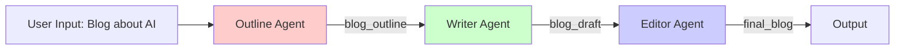
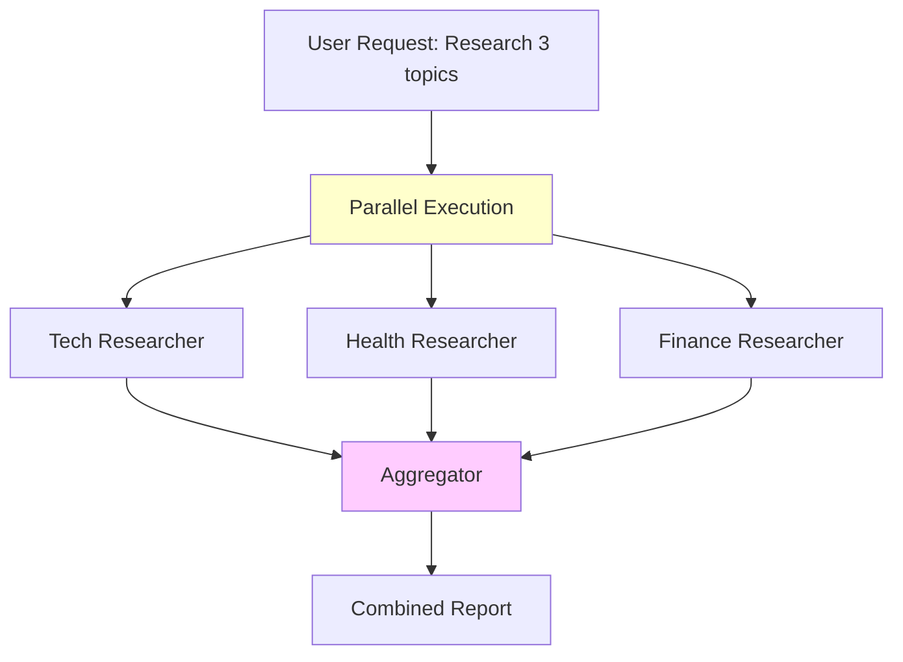
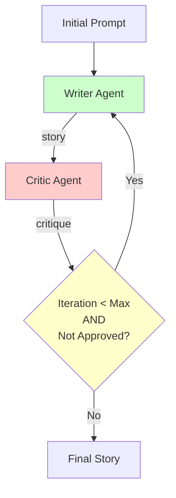
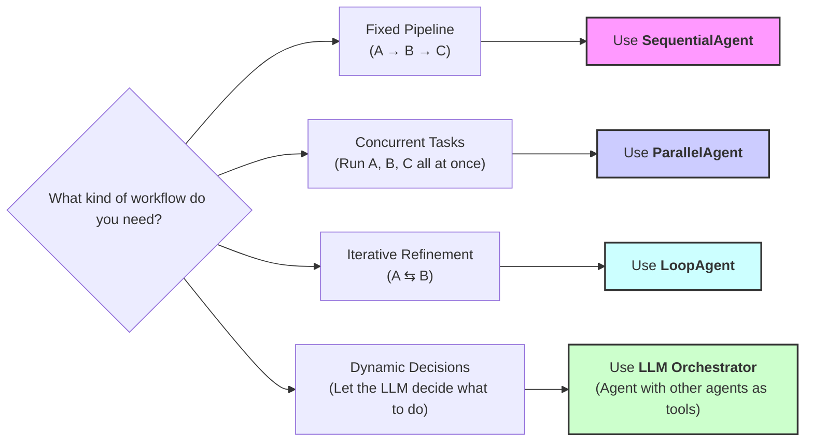

# 5-Day AI Agents Intensive Course with Google!

## Day 1 🚀 Multi-Agent Systems & Workflow Patterns

### 🚥 Sequential Workflows - The Assembly Line

**The Problem: Unpredictable Order**

The previous multi-agent system worked, but it relied on a **detailed instruction prompt** to force the LLM to run steps in order. This can be unreliable. A complex LLM might decide to skip a step, run them in the wrong order, or get "stuck," making the process unpredictable.

**The Solution: A Fixed Pipeline**

When you need tasks to happen in a **guaranteed, specific order**, you can use a `SequentialAgent`. This agent acts like an assembly line, running each sub-agent in the exact order you list them. The output of one agent automatically becomes the input for the next, creating a predictable and reliable workflow.

**Use Sequential when:** Order matters, you need a linear pipeline, or each step builds on the previous one.

To learn more, check out the documentation related to [sequential agents in ADK](https://google.github.io/adk-docs/agents/workflow-agents/sequential-agents/).

**Architecture: Blog Post Creation Pipeline**

**[Example: blog_writer/agent.py](blog_writer/agent.py)**

### 🛣️ Parallel Workflows - Independent Researchers

**The Problem: The Bottleneck**

The previous sequential agent is great, but it's an assembly line. Each step must wait for the previous one to finish. What if you have several tasks that are **not dependent** on each other? For example, researching three *different* topics. Running them in sequence would be slow and inefficient, creating a bottleneck where each task waits unnecessarily.

**The Solution: Concurrent Execution**

When you have independent tasks, you can run them all at the same time using a `ParallelAgent`. This agent executes all of its sub-agents concurrently, dramatically speeding up the workflow. Once all parallel tasks are complete, you can then pass their combined results to a final 'aggregator' step.

**Use Parallel when:** Tasks are independent, speed matters, and you can execute concurrently.

To learn more, check out the documentation related to [parallel agents in ADK](https://google.github.io/adk-docs/agents/workflow-agents/parallel-agents/).

**Architecture: Multi-Topic Research**

**[Example: researcher/agent.py](researcher/agent.py)**

### ➰ Loop Workflows - The Refinement Cycle

**The Problem: One-Shot Quality**

All the workflows we've seen so far run from start to finish. The `SequentialAgent` and `ParallelAgent` produce their final output and then stop. This 'one-shot' approach isn't good for tasks that require refinement and quality control. What if the first draft of our story is bad? We have no way to review it and ask for a rewrite.

**The Solution: Iterative Refinement**

When a task needs to be improved through cycles of feedback and revision, you can use a `LoopAgent`. A `LoopAgent` runs a set of sub-agents repeatedly *until a specific condition is met or a maximum number of iterations is reached.* This creates a refinement cycle, allowing the agent system to improve its own work over and over.

**Use Loop when:** Iterative improvement is needed, quality refinement matters, or you need repeated cycles.

To learn more, check out the documentation related to [loop agents in ADK](https://google.github.io/adk-docs/agents/workflow-agents/loop-agents/).

**Architecture: Story Writing & Critique Loop**

**[Example: story_writer/agent.py](story_writer/agent.py)**

### Choosing the Right Pattern

#### Decision Tree: Which Workflow Pattern?

#### Quick Reference Table

| Pattern                    | When to Use                      | Example                                             | Key Feature              |
| -------------------------- | -------------------------------- | --------------------------------------------------- | ------------------------ |
| **LLM-based (sub_agents)** | Dynamic orchestration needed     | [Research + Summarize]()                            | LLM decides what to call |
| **Sequential**             | Order matters, linear pipeline   | [Outline → Write → Edit](blog_writer/agent.py)      | Deterministic order      |
| **Parallel**               | Independent tasks, speed matters | [Multi-topic research](researcher/agent.py)         | Concurrent execution     |
| **Loop**                   | Iterative improvement needed     | [Writer + Critic refinement](story_writer/agent.py) | Repeated cycles          |