# 5-Day AI Agents Intensive Course with Google!

> [!NOTE]
> This repository is the result of completing the steps in the course https://www.kaggle.com/learn-guide/5-day-agents. **I highly recommend completing the course yourself.** 
> 
> You might find it useful that the model API is accessed through [OpenRouter](https://openrouter.ai/), not the official Google API.

## Day 1 🚀 Multi-Agent Systems & Workflow Patterns

### 🚥 Sequential Workflows - The Assembly Line

**The Problem: Unpredictable Order**

The previous multi-agent system worked, but it relied on a **detailed instruction prompt** to force the LLM to run steps in order. This can be unreliable. A complex LLM might decide to skip a step, run them in the wrong order, or get "stuck," making the process unpredictable.

**The Solution: A Fixed Pipeline**

When you need tasks to happen in a **guaranteed, specific order**, you can use a `SequentialAgent`. This agent acts like an assembly line, running each sub-agent in the exact order you list them. The output of one agent automatically becomes the input for the next, creating a predictable and reliable workflow.

**Use Sequential when:** Order matters, you need a linear pipeline, or each step builds on the previous one.

To learn more, check out the documentation related to [sequential agents in ADK](https://google.github.io/adk-docs/agents/workflow-agents/sequential-agents/).

**Architecture: Blog Post Creation Pipeline**


**[Example: blog_writer/agent.py](blog_writer/agent.py)**


### 🛣️ Parallel Workflows - Independent Researchers

**The Problem: The Bottleneck**

The previous sequential agent is great, but it's an assembly line. Each step must wait for the previous one to finish. What if you have several tasks that are **not dependent** on each other? For example, researching three *different* topics. Running them in sequence would be slow and inefficient, creating a bottleneck where each task waits unnecessarily.

**The Solution: Concurrent Execution**

When you have independent tasks, you can run them all at the same time using a `ParallelAgent`. This agent executes all of its sub-agents concurrently, dramatically speeding up the workflow. Once all parallel tasks are complete, you can then pass their combined results to a final 'aggregator' step.

**Use Parallel when:** Tasks are independent, speed matters, and you can execute concurrently.

To learn more, check out the documentation related to [parallel agents in ADK](https://google.github.io/adk-docs/agents/workflow-agents/parallel-agents/).

**Architecture: Multi-Topic Research**


**[Example: researcher/agent.py](researcher/agent.py)**


### ➰ Loop Workflows - The Refinement Cycle

**The Problem: One-Shot Quality**

All the workflows we've seen so far run from start to finish. The `SequentialAgent` and `ParallelAgent` produce their final output and then stop. This 'one-shot' approach isn't good for tasks that require refinement and quality control. What if the first draft of our story is bad? We have no way to review it and ask for a rewrite.

**The Solution: Iterative Refinement**

When a task needs to be improved through cycles of feedback and revision, you can use a `LoopAgent`. A `LoopAgent` runs a set of sub-agents repeatedly *until a specific condition is met or a maximum number of iterations is reached.* This creates a refinement cycle, allowing the agent system to improve its own work over and over.

**Use Loop when:** Iterative improvement is needed, quality refinement matters, or you need repeated cycles.

To learn more, check out the documentation related to [loop agents in ADK](https://google.github.io/adk-docs/agents/workflow-agents/loop-agents/).

**Architecture: Story Writing & Critique Loop**


**[Example: story_writer/agent.py](story_writer/agent.py)**


### Choosing the Right Pattern

#### Decision Tree: Which Workflow Pattern?

```mermaid
flowchart LR
    A{"What kind of workflow do you need?"} --> B["Fixed Pipeline<br>(A → B → C)"];
    A --> C["Concurrent Tasks<br>(Run A, B, C all at once)"];
    A --> D["Iterative Refinement<br>(A ⇆ B)"];
    A --> E["Dynamic Decisions<br>(Let the LLM decide what to do)"];

    B --> B_S["Use <b>SequentialAgent</b>"];
    C --> C_S["Use <b>ParallelAgent</b>"];
    D --> D_S["Use <b>LoopAgent</b>"];
    E --> E_S["Use <b>LLM Orchestrator</b><br>(Agent with other agents as tools)"];

    style B_S fill:#f9f,stroke:#333,stroke-width:2px
    style C_S fill:#ccf,stroke:#333,stroke-width:2px
    style D_S fill:#cff,stroke:#333,stroke-width:2px
    style E_S fill:#cfc,stroke:#333,stroke-width:2px
```


#### Quick Reference Table

| Pattern                    | When to Use                      | Example                                             | Key Feature              |
| -------------------------- | -------------------------------- | --------------------------------------------------- | ------------------------ |
| **LLM-based (sub_agents)** | Dynamic orchestration needed     | [Research + Summarize]()                            | LLM decides what to call |
| **Sequential**             | Order matters, linear pipeline   | [Outline → Write → Edit](blog_writer/agent.py)      | Deterministic order      |
| **Parallel**               | Independent tasks, speed matters | [Multi-topic research](researcher/agent.py)         | Concurrent execution     |
| **Loop**                   | Iterative improvement needed     | [Writer + Critic refinement](story_writer/agent.py) | Repeated cycles          |

## Day 2 🚀 Agent Tools & Interoperability with Model Context Protocol (MCP)

### 🤖 What are Custom Tools?

**Custom Tools** are tools you build yourself using your own code and business logic. Unlike built-in tools that come ready-made with ADK, custom tools give you complete control over functionality.

**When to use Custom Tools?**

Built-in tools like Google Search are powerful, but **every business has unique requirements** that generic tools can't handle. Custom tools let you implement your specific business logic, connect to your systems, and solve domain-specific problems. ADK provides multiple custom tool types to handle these scenarios.

#### Building Custom Function Tools

#### Example: Currency Converter Agent

This agent can convert currency from one denomination to another and calculates the fees to do the conversion. The agent has two custom tools and follows the workflow:

1. **Fee Lookup Tool** - Finds transaction fees for the conversion (mock)
2. **Exchange Rate Tool** - Gets currency conversion rates (mock)
3. **Calculation Step** - Calculates the total conversion cost including the fees


**Example: [currency_agent/agent.py](currency_agent/agent.py)**


### 💻 Improving Agent Reliability with Code

The agent's instruction says *"calculate the final amount after fees"* but LLMs aren't always reliable at math. They might make calculation errors or use inconsistent formulas.

##### 💡 **Solution:** Let's ask our agent to generate a Python code to do the math, and run it to give us the final result! Code execution is much more reliable than having the LLM try to do math in its head!


**Example: [calculation_agent/agent.py](calculation_agent/agent.py)**


### 🤔 Agent Tools vs Sub-Agents: What's the Difference?

This is a common question! Both involve using multiple agents, but they work very differently:

**Agent Tools (what we're using):**
- Agent A calls Agent B as a tool
- Agent B's response goes **back to Agent A**
- Agent A stays in control and continues the conversation
- **Use case**: Delegation for specific tasks (like calculations)

**Sub-Agents (different pattern):**
- Agent A transfers control **completely to Agent B**
- Agent B takes over and handles all future user input
- Agent A is out of the loop
- **Use case**: Handoff to specialists (like customer support tiers)

**In our currency example:** We want the currency agent to get calculation results and continue working with them, so we use **Agent Tools**, not sub-agents.


### 🧰 Complete Guide to ADK Tool Types

Now that you've seen tools in action, let's understand the complete ADK toolkit:

It's broadly divided into two categories: **Custom tools** and **Built-in tools**

#### **1. Custom Tools**


**What**: Tools you build yourself for specific needs

**Advantage**: Complete control over functionality — you build exactly what your agent needs

##### **Function Tools** ✅ (You've used these!)
- **What**: Python functions converted to agent tools
- **Examples**: `get_fee_for_payment_method`, `get_exchange_rate`
- **Advantage**: Turn any Python function into an agent tool instantly

##### **Long Running Function Tools**
- **What**: Functions for operations that take significant time
- **Examples**: Human-in-the-loop approvals, file processing
- **Advantage**: Agents can start tasks and continue with other work while waiting

##### **Agent Tools** ✅ (You've used these!)
- **What**: Other agents used as tools
- **Examples**: `AgentTool(agent=calculation_agent)`
- **Advantage**: Build specialist agents and reuse them across different systems

##### **MCP Tools**
- **What**: Tools from Model Context Protocol servers
- **Examples**: Filesystem access, Google Maps, databases
- **Advantage**: Connect to any MCP-compatible service without custom integration

##### **OpenAPI Tools**
- **What**: Tools automatically generated from API specifications
- **Examples**: REST API endpoints become callable tools
- **Advantage**: No manual coding — just provide an API spec and get working tools


#### **2. Built-in Tools**


**What**: Pre-built tools provided by ADK

**Advantage**: No development time — use immediately with zero setup

#### **Gemini Tools** ✅ (You've used these!)
- **What**: Tools that leverage Gemini's capabilities
- **Examples**: `google_search`, `BuiltInCodeExecutor`
- **Advantage**: Reliable, tested tools that work out of the box

#### **Google Cloud Tools** [needs Google Cloud access]
- **What**: Tools for Google Cloud services and enterprise integration
- **Examples**: `BigQueryToolset`, `SpannerToolset`, `APIHubToolset`
- **Advantage**: Enterprise-grade database and API access with built-in security

#### **Third-party Tools**
- **What**: Wrappers for existing tool ecosystems
- **Examples**: Hugging Face, Firecrawl, GitHub Tools
- **Advantage**: Reuse existing tool investments — no need to rebuild what already exists

### 🚀 Agent Tool Patterns and Best Practices

#### 🧰 Model Context Protocol

So far, you have learned how to create custom functions for your agents. But connecting to external systems (GitHub, databases, Slack) requires writing and maintaining API clients.

**Model Context Protocol (MCP)** is an open standard that lets agents use community-built integrations. Instead of writing your own integrations and API clients, just connect to an existing MCP server.

MCP enables agents to:

✅ **Access live, external data** from databases, APIs, and services without custom integration code  
✅ **Leverage community-built tools** with standardized interfaces  
✅ **Scale capabilities** by connecting to multiple specialized servers

#### How MCP Works

MCP connects your agent (the **client**) to external **MCP servers** that provide tools:

- **MCP Server**: Provides specific tools (like image generation, database access)
- **MCP Client**: Your agent that uses those tools
- **All servers work the same way** - standardized interface

**Architecture:**
```
┌──────────────────┐
│   Your Agent     │
│   (MCP Client)   │
└────────┬─────────┘
         │
         │ Standard MCP Protocol
         │
    ┌────┴────┬────────┬────────┐
    │         │        │        │
    ▼         ▼        ▼        ▼
┌────────┐ ┌─────┐ ┌──────┐ ┌─────┐
│ GitHub │ │Slack│ │ Maps │ │ ... │
│ Server │ │ MCP │ │ MCP  │ │     │
└────────┘ └─────┘ └──────┘ └─────┘
```

#### Using MCP with Your Agent

The workflow is simple:

1. Choose an MCP Server and tool
2. Create the MCP Toolset (configure connection)
3. Add it to your agent
4. Run and test the agent

**Step 1: Choose MCP Server**

For this demo, we'll use the **[Everything MCP Server](https://github.com/modelcontextprotocol/servers/tree/main/src/everything)** - an npm package (`@modelcontextprotocol/server-everything`) designed for testing MCP integrations.

It provides a `getTinyImage` tool that returns a simple test image (16x16 pixels, Base64-encoded). **Find more servers:** [modelcontextprotocol.io/examples](https://modelcontextprotocol.io/examples)

**‼️ NOTE: This is a demo server to learn MCP.** In production, you'll use servers for Google Maps, Slack, Discord, etc.

**Step 2: Create the MCP Toolset**

The `McpToolset` is used to integrate an ADK Agent with an MCP Server.

**What the code does:**
- Uses `npx` (Node package runner) to run the MCP server
- Connects to `@modelcontextprotocol/server-everything`
- Filters to only use the `getTinyImage` tool (the server has others, but we only need this one)

**Example: [image_agent/agent.py](image_agent/agent.py)**

#### 🔄 Long-Running Operations (Human-in-the-Loop)

So far, all tools execute and return immediately:


> ```User asks → Agent calls tool → Tool returns result → Agent responds```


**But what if your tools are long-running or you need human approval before completing an action?**

Example: A shipping agent should ask for approval before placing a large order.


> ```User asks → Agent calls tool → Tool PAUSES and asks human → Human approves → Tool completes → Agent responds```


This is called a **Long-Running Operation (LRO)** - the tool needs to pause, wait for external input (human approval), then resume.

**When to use Long-Running Operations:**

- 💰 **Financial transactions** requiring approval (transfers, purchases)
- 🗑️ **Bulk operations** (delete 1000 records - confirm first!)
- 📋 **Compliance checkpoints** (regulatory approval needed)
- 💸 **High-cost actions** (spin up 50 servers - are you sure?)
- ⚠️ **Irreversible operations** (permanently delete account)

##### Understanding the Code

Now that you've seen the complete function, let's break down how it works.


**Example: [shipping_agent/agent.py](shipping_agent/agent.py)**

